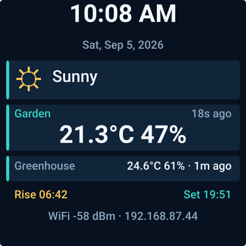
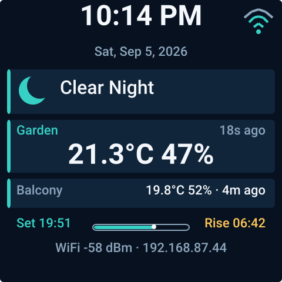
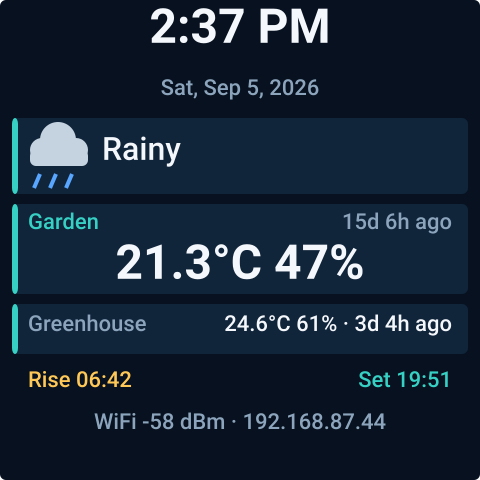
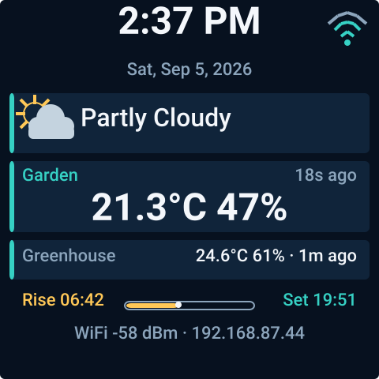
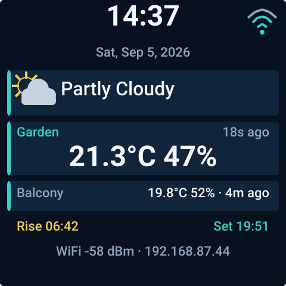

<!-- SPDX-License-Identifier: GPL-3.0-or-later -->

# ESPHome Weather Station

An ESPHome external component for receiving and independently routing multiple
433.92 MHz weather stations on the GeekMagic SmallTV Ultra.

The tested target is the **GeekMagic SmallTV Ultra ESP8266, 240×240 display
variant**, using its existing OOK receiver path. The component currently
publishes temperature, humidity, channel, rolling code, and battery-low state
from an Oregon Scientific THGR122N.

Future CC1101 hardware support is intentionally planned only in this public
repository. Solight decoding, page switching, and CAD are not implemented yet.

## Use as an external component

```yaml
external_components:
  - source: github://hryamzik/esphome-weather-station@main
    components: [weather_station, weather_station_screen]

remote_receiver:
  id: rf_receiver
  pin: GPIO3
  tolerance: 50%
  filter: 250us
  idle: 4ms

weather_station:
  id: weather_decoder
  receiver_id: rf_receiver
  protocols: [oregon2]
  stations:
    - id: garden
      name: Garden
      primary: true
      selector:
        protocol: oregon2
        model: 0x1D20
        channel: 1
        # Omit rolling_code to accept sensor battery resets.
      temperature:
        name: Garden Temperature
      humidity:
        name: Garden Humidity
      battery_low:
        name: Garden Battery Low
      age:
        name: Garden Station Age
  ignore:
    - protocol: oregon2
      model: 0x1D20
      channel: 3
  diagnostics:
    last_unknown_selector:
      name: Last Unknown Weather Station
    recent_unknown_count:
      name: Recent Unknown Weather Stations
    unknown_window: 5min
```

Receiver pins vary between device revisions; verify your board before flashing.
See `examples/geekmagic-smalltv-ultra.yaml` for the complete display and
hardware configuration.

## 240×240 single-screen display

The screen uses the routing API directly: the explicit or first-heard primary
station remains prominent while configured secondaries rotate every two
seconds. Time comes from ESPHome's Home Assistant time platform, so the device
does not duplicate timezone configuration. Home Assistant condition, sun
state, sunrise, and sunset text entity IDs are ordinary configurable YAML
imports. Sunrise/sunset values may be clock times or preformatted countdowns.







```yaml
time:
  - platform: homeassistant
    id: ha_time

text_sensor:
  - platform: homeassistant
    id: current_condition
    entity_id: weather.home
  - platform: homeassistant
    id: next_sunrise
    entity_id: sensor.next_sunrise_display

weather_station_screen:
  id: weather_screen
  weather_station_id: weather_decoder
  time_id: ha_time
  fonts: {small: font_small, medium: font_medium, large: font_large}
  hour_format: 12h # or 24h
  condition_id: current_condition
  sunrise_id: next_sunrise
  sections:
    time: true
    date: true
    condition: true
    primary: true
    secondary: true
    sun: true
    network: true

display:
  # ... GeekMagic ST7789V pins; see the complete example
  lambda: |-
    id(weather_screen).render(it);
```

All seven sections can be hidden independently. Icons are original primitive
vector glyphs drawn by this project; no third-party weather icon set is
embedded. The example obtains Roboto from Google Fonts under OFL-1.1; see
`THIRD_PARTY_NOTICES.md`.

## Routing behavior

- `protocols` is a compile-time allow-list. The component accepts only `oregon2`;
  unsupported names are configuration errors. Protocol adapters and capability
  flags provide the extension seam for Solight.
- Every configured station has a stable, separate set of optional entities.
  Selectors require protocol, model, and channel. `rolling_code` is optional;
  omitting it matches any rolling code.
- Overlapping configured selectors are rejected, including a rolling-code
  wildcard beside a specific code. `ignore` selectors may overlap and always
  win.
- Decodable but unconfigured stations update discovery diagnostics only. The
  last-unknown text entity contains a ready-to-paste YAML `selector`, while the
  count reports distinct unknown selectors heard in the configured window.
- One station may set `primary: true`. Without one, the first configured
  station heard becomes the stable primary fallback. Latest reading and
  last-seen/age state feed the screen directly; `age` also exposes that state
  as an optional ESPHome sensor.

## Migrating from Milestone 1

The former flat `temperature`, `humidity`, `channel`, `rolling_code`, and
`battery_low` keys did not identify a station and therefore could not safely
support multiple transmitters. Move those entities under a `stations` entry,
add its selector, and add `protocols: [oregon2]` as shown above. The flat form
is intentionally rejected instead of silently assigning unknown transmitters.

## Development

Python 3.11+ and a C++17 compiler are required.

```sh
make setup
make test
make preview
make esphome-config
make esphome-compile
```

`make test` compiles the production decoder natively and decodes the committed,
second-receiver-verified Flipper BinRAW capture. It also checks display
formatting and verifies every committed SVG against the production layout
engine. `make preview` regenerates deterministic screenshots in
`docs/previews/` without firmware or hardware. See
`docs/architecture.md` for module boundaries, `docs/supported-protocols.md` for
support confidence, and `CONTRIBUTING.md` for the fixture ladder required for
new protocols.

## Attribution and licensing

Oregon2 behavior was compared with the Weather Station application from
[flipperdevices/flipperzero-good-faps at commit 55328b486971e49078a955a7c086e4463fa6843b](https://github.com/flipperdevices/flipperzero-good-faps/tree/55328b486971e49078a955a7c086e4463fa6843b/weather_station).
At extraction time this was the repository's current latest commit and the
repository published no tags. Its nominal Oregon2 timings and decoded behavior
served as a reference; this decoder was independently implemented against
published protocol behavior and the verified capture. See `NOTICE.md`.

Software is licensed under `GPL-3.0-or-later`. Future hardware design assets
under `hardware/cad/` are reserved for `CERN-OHL-S-2.0`; no CAD is included yet.
