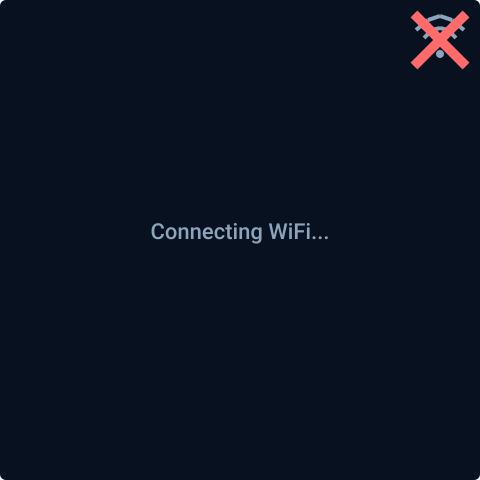
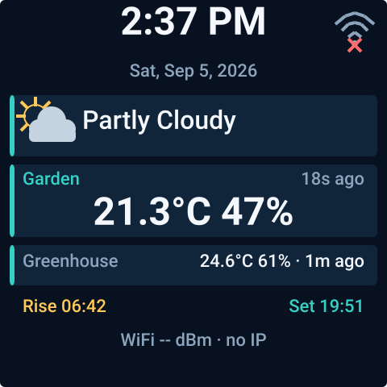

<!-- SPDX-License-Identifier: GPL-3.0-or-later -->

# ESPHome Weather Station

An ESPHome external component for receiving and independently routing multiple
433.92 MHz weather stations on the GeekMagic SmallTV Ultra.

The tested target is the **GeekMagic SmallTV Ultra ESP8266, 240×240 display
variant**, using its existing OOK receiver path. The component currently
publishes temperature, humidity, channel, rolling code, and battery-low state
from an Oregon Scientific THGR122N.

Future CC1101 hardware support is intentionally planned only in this public
repository. Solight decoding, page switching, and CAD are not implemented yet.

## Use as an external component

```yaml
external_components:
  - source: github://hryamzik/esphome-weather-station@main
    components: [weather_station, weather_station_screen]

remote_receiver:
  id: rf_receiver
  pin: GPIO3
  tolerance: 50%
  filter: 250us
  idle: 4ms

weather_station:
  id: weather_decoder
  receiver_id: rf_receiver
  protocols: [oregon2]
  stations:
    - id: garden
      name: Garden
      primary: true
      selector:
        protocol: oregon2
        model: 0x1D20
        channel: 1
        # Omit rolling_code to accept sensor battery resets.
      temperature:
        name: Garden Temperature
      humidity:
        name: Garden Humidity
      battery_low:
        name: Garden Battery Low
      age:
        name: Garden Station Age
  ignore:
    - protocol: oregon2
      model: 0x1D20
      channel: 3
  diagnostics:
    last_unknown_selector:
      name: Last Unknown Weather Station
    recent_unknown_count:
      name: Recent Unknown Weather Stations
    unknown_window: 5min
```

Receiver pins vary between device revisions; verify your board before flashing.
See `examples/geekmagic-smalltv-ultra.yaml` for the complete display and
hardware configuration. Its 12% striped 8-bit display setting is intentional.
ESPHome 2026.8.2 rejects 6.25% (`buffer_size` has a 12% minimum); its stripe
denominator logic maps 12% to one-tenth of this 240-row panel, or 5,760 pixel
bytes. That saves 1,440 bytes versus the former 12.5%/one-eighth buffer while
remaining an exact row divisor.

## 240×240 single-screen display

The screen uses the routing API directly: the explicit or first-heard primary
station remains prominent while configured secondaries rotate every two
seconds. Time comes from ESPHome's Home Assistant time platform, so the device
does not duplicate timezone configuration. Home Assistant condition, sun
state, sunrise, and sunset text entity IDs are ordinary configurable YAML
imports. Sunrise/sunset values may be clock times or preformatted countdowns.
During daytime the sun row reads Rise → Set; at night it reads Set → Rise. An
optional HA numeric sensor supplies 0–100% progress for the compact bar between
them, keeping timezone and astronomy calculations out of the device.






```yaml
time:
  - platform: homeassistant
    id: ha_time

text_sensor:
  - platform: homeassistant
    id: current_condition
    entity_id: weather.home
  - platform: homeassistant
    id: next_sunrise
    entity_id: sensor.next_sunrise_display

sensor:
  - platform: homeassistant
    id: sun_progress
    entity_id: sensor.sun_cycle_progress

weather_station_screen:
  id: weather_screen
  weather_station_id: weather_decoder
  time_id: ha_time
  fonts: {small: font_small, medium: font_medium, large: font_large}
  hour_format: 12h # or 24h
  condition_id: current_condition
  sunrise_id: next_sunrise
  sun_progress_id: sun_progress
  sections:
    time: true
    date: true
    condition: true
    primary: true
    secondary: true
    sun: true
    network: true

display:
  # ... GeekMagic ST7789V pins; see the complete example
  lambda: |-
    id(weather_screen).render(it);
```

All seven sections can be hidden independently. The network section controls
both the detailed bottom RSSI/IP row and the traditional top-right Wi-Fi icon.
The icon has distinct weak/fair/good levels and an explicit crossed-out state
when RSSI is unavailable; its full-glyph diagonal cross remains visible at
240×240. The sun progress bar disappears cleanly when `sun_progress_id` has no
state or is omitted. Icons are original primitive vector glyphs drawn by this
project; no third-party weather icon set is embedded. The example obtains
Roboto from Google Fonts under OFL-1.1; see `THIRD_PARTY_NOTICES.md`.

### ESP8266 memory budget

The production render cycle is allocation-free: snapshots use fixed text and
eight fixed secondary slots, and drawing commands stream directly to the
display without an intermediate container. Host previews use a bounded scene
with 52 fixed commands and a 384-byte text arena. Overflow is explicit and
host-tested; configured station entities are unaffected if more than eight
secondaries exist, but only the first eight are display candidates. The
ESPHome YAML interface is unchanged.

For the tested GeekMagic target, measure with encrypted API connected after at
least one RF decode and display render:

- free heap target: **at least 24 KiB**
- largest free block target: **at least 16 KiB**
- CI static RAM ceiling: **55%**
- CI flash ceiling: **65%**

Runtime targets require staged-device measurement; linker percentages are only
secondary regression guards. The full compile target enforces both static
ceilings, and the native display test instruments 1,000 production scene
builds and requires zero allocations after setup. Home Assistant condition and
sun values remain optional: missing HA/time/network state renders explicit
fallbacks while local RF station values continue to display.

The ESPHome wrapper reads RSSI and IP directly from the configured Wi-Fi
component, avoiding dedicated `wifi_signal` and `wifi_info` entities. Existing
`wifi_signal_id` and `ip_address_id` settings remain supported as explicit
overrides. This dependency stays in the thin ESPHome wrapper; snapshots and the
host-testable layout remain platform-independent.

### Startup safety

Before Wi-Fi has connected once after boot, `render()` draws only the
allocation-free startup background, disconnected Wi-Fi glyph, and
`Connecting WiFi...` label. It does not snapshot Home Assistant/router state
or stream the full scene while the ESP8266 is asynchronously associating.
Once ESPHome reports a real connection, the screen latches into full rendering
for the rest of that boot. A later outage therefore keeps local RF weather
visible and changes only network diagnostics to the disconnected state.

This gate addresses hardware evidence that simple fill rendering remains
networked while full striped scene drawing during association does not. The
one-second update interval is intentionally unchanged: delaying every frame
would mask the association-specific issue and degrade the running display.

## Routing behavior

- `protocols` is a compile-time allow-list. The component accepts only `oregon2`;
  unsupported names are configuration errors. Protocol adapters and capability
  flags provide the extension seam for Solight.
- Every configured station has a stable, separate set of optional entities.
  Selectors require protocol, model, and channel. `rolling_code` is optional;
  omitting it matches any rolling code.
- Overlapping configured selectors are rejected, including a rolling-code
  wildcard beside a specific code. `ignore` selectors may overlap and always
  win.
- Decodable but unconfigured stations update discovery diagnostics only. The
  last-unknown text entity contains a ready-to-paste YAML `selector`, while the
  count reports distinct unknown selectors heard in the configured window.
- One station may set `primary: true`. Without one, the first configured
  station heard becomes the stable primary fallback. Latest reading and
  last-seen/age state feed the screen directly; `age` also exposes that state
  as an optional ESPHome sensor.

## Migrating from Milestone 1

The former flat `temperature`, `humidity`, `channel`, `rolling_code`, and
`battery_low` keys did not identify a station and therefore could not safely
support multiple transmitters. Move those entities under a `stations` entry,
add its selector, and add `protocols: [oregon2]` as shown above. The flat form
is intentionally rejected instead of silently assigning unknown transmitters.

## Development

Python 3.11+ and a C++17 compiler are required.

```sh
make setup
make test
make preview
make esphome-config
make esphome-compile
```

`make test` compiles the production decoder natively and decodes the committed,
second-receiver-verified Flipper BinRAW capture. It also checks display
formatting, fixed-capacity overflow behavior, and allocation-free repeated
scene generation, and verifies every committed SVG against the production
layout engine. `make preview` regenerates deterministic screenshots in
`docs/previews/` without firmware or hardware. See
`docs/architecture.md` for module boundaries, `docs/supported-protocols.md` for
support confidence, and `CONTRIBUTING.md` for the fixture ladder required for
new protocols.

## Attribution and licensing

Oregon2 behavior was compared with the Weather Station application from
[flipperdevices/flipperzero-good-faps at commit 55328b486971e49078a955a7c086e4463fa6843b](https://github.com/flipperdevices/flipperzero-good-faps/tree/55328b486971e49078a955a7c086e4463fa6843b/weather_station).
At extraction time this was the repository's current latest commit and the
repository published no tags. Its nominal Oregon2 timings and decoded behavior
served as a reference; this decoder was independently implemented against
published protocol behavior and the verified capture. See `NOTICE.md`.

Software is licensed under `GPL-3.0-or-later`. Future hardware design assets
under `hardware/cad/` are reserved for `CERN-OHL-S-2.0`; no CAD is included yet.
