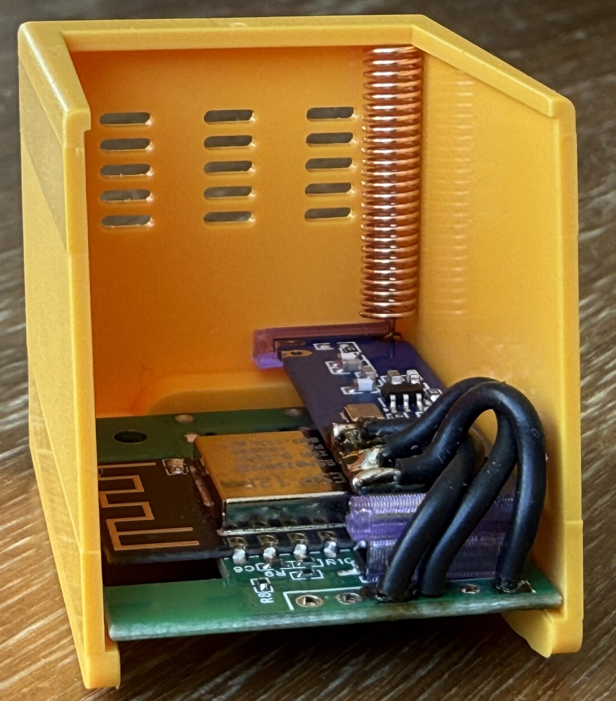
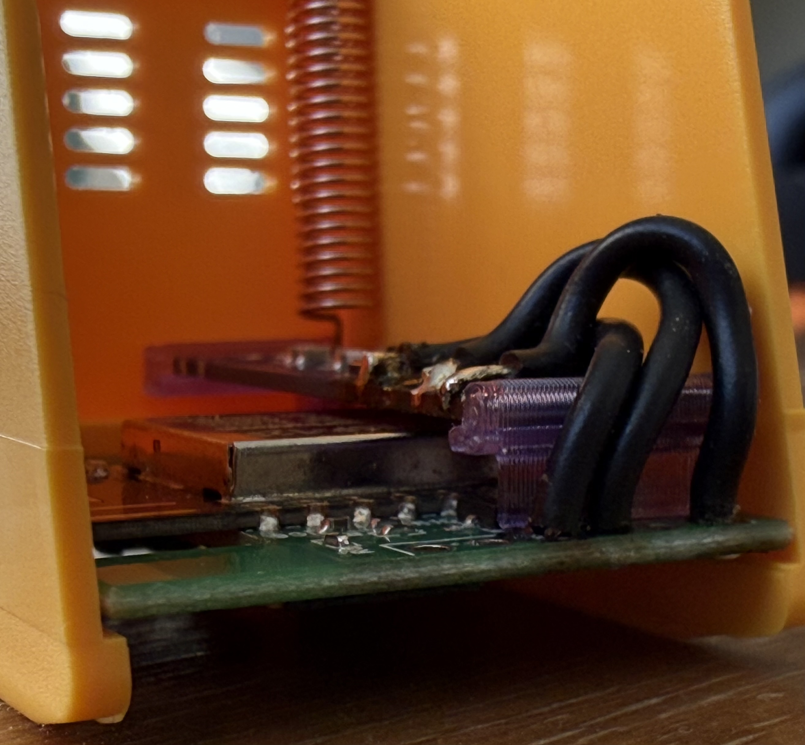

<!-- SPDX-License-Identifier: GPL-3.0-or-later -->

# Hardware installation

The tested assembly adds an SRX882S 433.92 MHz OOK receiver to a GeekMagic
SmallTV Ultra. A printed holder keeps the receiver inside the enclosure; its
editable and printable files are in [`cad/`](cad/).

## Installed receiver

The photos document one working installation, not a universal pinout. Device
revisions can differ, so verify power, ground, receiver data, and antenna
clearance against your board before soldering. Insulate exposed contacts and
add wire strain relief before closing the enclosure.

The firmware example uses GPIO3 for receiver data. Confirm that choice against
your hardware before flashing; do not infer wiring solely from the photographs.
